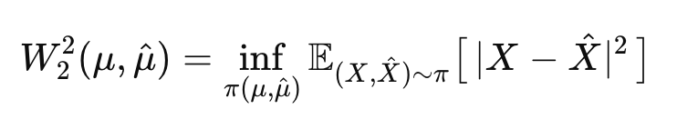
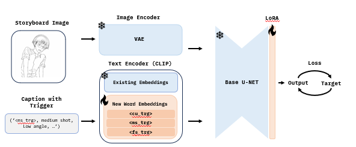

# Storyboard Trigger Project

## 1. 프로젝트 소개
영화, 드라마, 뮤직비디오 등의 영상 콘텐츠 제작 시 필수적으로 스토리보드 작업이 꼭 선행되어야 합니다.

하지만! 기존의 스토리보드 제작은 많은 시간과 비용이 드는 수작업에 의존해야 했으며, PD나 감독이 직접 그림을 그리거나 전문 스토리보드 작가를 고용해야 했습니다.

저희는 이를 Scene 정보(장면 설명, 대사)와 Shot 정보(Close-up shot, Medium shot, Full shot)를 입력받아 깨끗한 스케치 형태의 스토리보드 이미지를 자동으로 생성하는 파이프라인을 구축하고자 합니다. 

이를 통해 창작자들이 보다 쉽게 스토리보드를 제작하고 제작 효율을 높이고자 하였습니다

## 2. 디렉터리 구성
| 경로 | 설명 |
| --- | --- |
| `Dataset_collect_title_method/` | 원본 스틸컷 메타데이터 정리 및 캡션/타이틀 매칭 스크립트 |
| `Data_preprocessing_method/`, `Data_preprocessing_Line/` | 말풍선 제거, 1024 정사각 변환, SDXL ControlNet 라인아트 생성 등 데이터 정제 단계 |
| `Dataset_clustering_method/` | CLIP 임베딩 기반 장면/샷 타입 클러스터링 코드 및 사전 계산된 가중치 |
| `Dataset_fin/` | 모델 학습에 사용한 최종 이미지/JSONL. 실제 운용 시 로컬 동일 경로에 배치 |
| `train_trigger02.py`, `shot_trigger_train.sh` | LoRA 및 커스텀 Trigger Token 학습 스크립트와 실행 셸 |
| `inference_trigger.py`, `inference_trigger2.sh` | 학습된 토큰과 LoRA를 사용해 이미지를 합성하는 추론 파이프라인 |
| `validation/` | 검증용 JSONL, 배치 생성 스크립트, 멀티 GPU 실행 셸 포함 |
| `model_sd/`, `model_output/` | 베이스 Stable Diffusion 체크포인트와 생성 결과 저장소 |

> `model_sd/`, `model_output/`, `Dataset_fin/` 등 대용량 파일은 `.gitignore`에 등록되어 있으므로 공개 저장소에는 커밋되지 않습니다. 필요한 경우 동일한 디렉터리명으로 로컬에 배치한 뒤 스크립트 실행해야합니다

## 3. 환경 설정
```bash
pip install -r requirement.txt
```

## 4. 전처리
### 4.1 데이터 수집 및 정규화
1. `Dataset_collect_title_method/collect_title_matches.py`로 원본 JSONL을 통합하고, 중복 캡션/누락 항목을 정리합니다.
2. `Data_preprocessing_method/` 스크립트와 `Data_preprocessing_Line/01_preprocessing.py`를 사용해 1024x1024 정사각 이미지와 라인아트 버전을 생성합니다. 이때 ControlNet(Lineart) + SDXL 파이프라인을 활용해 노이즈를 최소화합니다.
3. `00_Canny.ipynb`로 rough한 edge/bubble 제거 결과를 확인합니다.

### 4.2 샷 분류 및 데이터 필터링
<p align="center">
  
</p>

- `Dataset_clustering_method/run_clip_clustering.py` + 사전 학습된 CLIP 가중치(`ViT-B-32-openai.pt`, `clip-vit-b-32.pt`)를 이용해 장면 별 샷 타입을 분류합니다
- Earth Mover’s Distance (Wasserstein-2) 기법을 이용해서 top-k에 해당하는 그림체를 보며 육안으로 봤을 때 이질적인 그림체가 나오는경우 그 직전까지 clustering을 진행했습니다.
- 결과는 `Dataset_fin/metadata.jsonl`로 출력됩니다.

### 4.3 번역 파이프라인
- `Data_preprocessing_method/02_translate.py` 스크립트를 통해 한국어 캡션을 영어로 일괄 번역합니다.
- 스크립트 실행 시 입력 텍스트 폴더(`--input-dir`)와 출력 폴더(`--output-dir`)를 지정하면 각 파일을 순회하며 `translated_*.txt` 형태로 결과를 저장합니다.

## 5. Train
<p align="center">
  
</p>

- 우선적으로 table Diffusion 모델에 Textueal Embedding을 적용합니다. 특정 구도나 스타일을 하나의 희귀 토큰에 묶어 모델이 사용자가 지정한 정보를 중점적으로 학습하도록 유도하는 기법이며 본 프로젝트에서는 CLIP의 임베딩 벡터에 Shot을 의미하는 3개의 희귀 토큰 <cu_trg>, <ms_trg>, <fs_trg>을 추가하여 구도 정보를 반영하는 것을 목표로 하였습니다. 이후 storyboard 데이터셋으로 Finetuning 하여 shot과 목표 그림체를 학습합니다.
- `train.sh` 주요 하이퍼파라미터(데이터 경로, 배치, rank 등)를 지정하고 `accelerate` 실행 구성을 로깅하는 스크립트를 실행합니다

## 6. Inference
- `inference.sh`는 학습된 LoRA + 텍스트 인코더 가중치를 로드해 사용자 프롬프트에 트리거 단어를 삽입한 뒤 결과 이미지를 저장하는 스크립트

## 7. Validation
- `validation/validation.sh`는 멀티 GPU 검증 생성하는 부분이며 학습된 LoRA 적용 추론 및 결과를 저장하는 스크립트
- `validation/vqa.ipynb`는 생성 이미지에 대한 Visual Question Answering 평가를 수행해 품질을 정량적으로 분석할 수 있는 노트북입니다. 검증 산출물을 불러와 VQA 점수나 예제를 확인할 때 활용합니다

